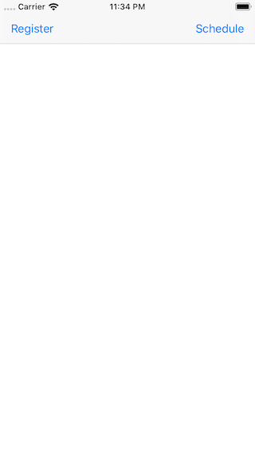
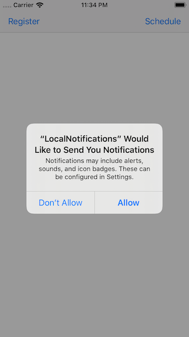
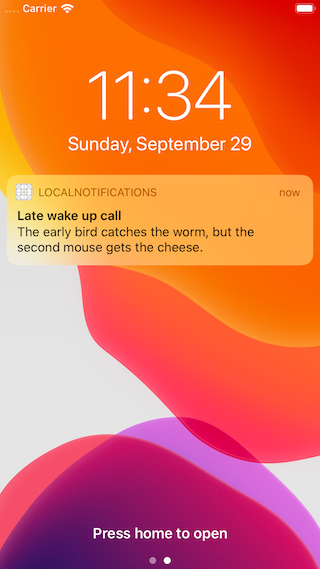

# Local Notifications

## Description
Send reminders to your user's lock screen to show them information when your app isn't running.

## Demo
### feature/scheduling-notifications
| Screenshot 01 | Screenshot 02 | Screenshot 03 |
| ------------- | ------------- | ------------- |
|  |  |  |